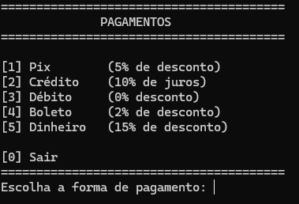
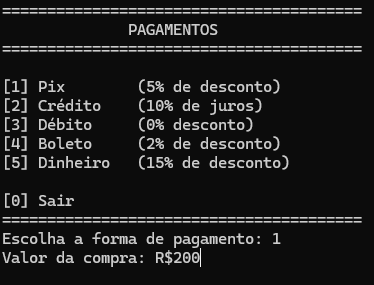
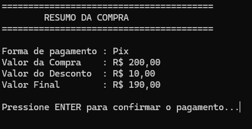
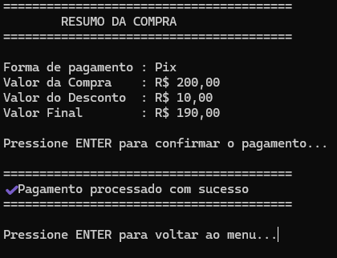
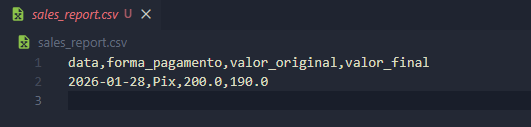

# 💳 Payment System CLI

A simple and well-structured **command-line payment system** built with Python.  
This project was developed as a **study case** to practice clean architecture, basic OOP principles, and user-friendly CLI design.

---

## 📌 Features

- Multiple payment methods:
  - Pix (5% discount)
  - Credit Card (10% interest)
  - Debit Card (no discount/interest)
  - Boleto (2% discount)
  - Cash (15% discount)
- Automatic calculation of final price
- Clean and readable terminal interface
- Sales history saved in a CSV file
- Error handling for invalid inputs

---

## 📸 Screenshots

### 1. Main Menu


### 2. Chose Option


### 3. Resume Payment


### 4. Confirm Payment


### 5. Exemple CSV

---


## 🧱 Project Structure

```

project/
│
├── payments/
│   ├── **init**.py
│   └── methods.py        # Payment methods and business rules
│
├── reports/
│   ├── **init**.py
│   └── sales_report.py   # CSV sales report generation
│
├── utils/
│   ├── **init**.py
│   ├── input.py          # User input validation
│   ├── terminal_commands.py
│   └── ui.py             # Terminal UI and formatting
│
├── main.py               # Application entry point
├── requirements.txt
└── LICENSE

````

---

## 🧠 Design Decisions

- **Separation of concerns**  
  Business logic, UI, input handling, and persistence are separated into different modules.

- **Object-Oriented Programming**  
  Each payment method is implemented as a class using inheritance and polymorphism, making the system easy to extend.

- **Extensibility**  
  New payment methods can be added without modifying existing logic.

- **CLI UX matters**  
  Even as a terminal application, the interface was designed to be clear and friendly.

---

## ▶️ How to Run

1. Clone the repository:
   ```bash
   git clone https://github.com/omarcelodev/payment-system-cli.git

2. Navigate to the project folder:

   ```bash
   cd payment-system-cli
   ```

3. (Optional) Create and activate a virtual environment

4. Run the application:

   ```bash
   python main.py
   ```

---

## 📄 Sales Report

All completed payments are saved in a CSV file:

```
sales_report.csv
```

Each record contains:

* Date
* Payment method
* Original value
* Final value (with discount or interest)

---

## 🚀 Possible Improvements

* Add automated tests
* Allow viewing reports directly from the CLI
* Support coupons or promotional discounts
* Export reports in other formats (JSON, PDF)
* Improve internationalization (currency and language)

---

## 📚 Purpose

This project was created for **learning and portfolio purposes**, focusing on:

* Code organization
* Clean architecture
* Practical Python usage
* Writing maintainable and readable code

---

## 🧑‍💻 Author

Developed by **Marcelo**
